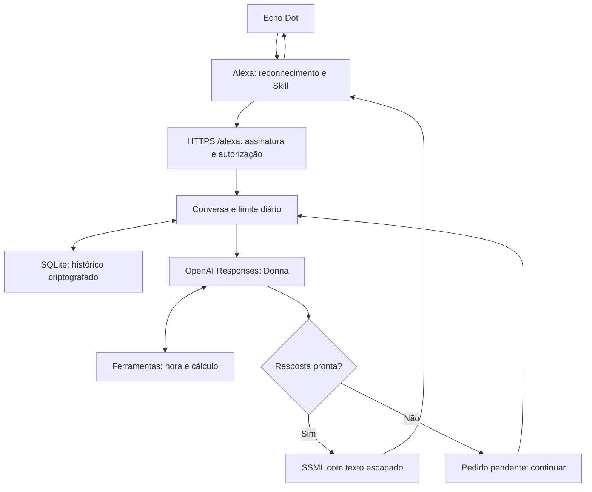
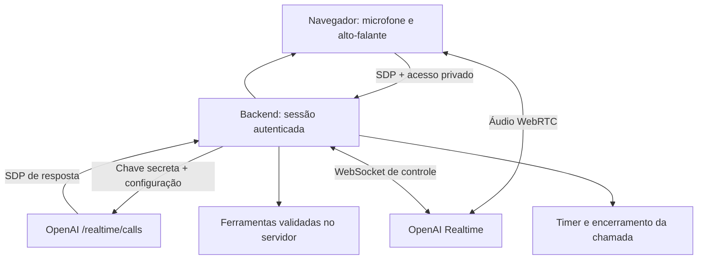

# Arquitetura e viabilidade

Pesquisa técnica: 12/09/2026. Decisões desta implementação; disponibilidade e latência reais dependem das contas e da ativação.

## Objetivo preciso

Construir um sistema independente chamado Gabriel Voice OS, acessível por voz, cujo agente Donna tenha instruções, contexto e ferramentas controlados pelo nosso backend. A Echo inicia a Skill, encaminha o pedido reconhecido e reproduz a resposta. O objetivo original de encaminhar o áudio bruto da Echo à OpenAI não é oferecido pela interface pública de Custom Skills consultada.

## Fluxo na Echo

1. A Amazon faz reconhecimento e roteia para `AskDonnaIntent`. O slot `query` usa `AMAZON.SearchQuery`, disponível em pt-BR. Os exemplos incluem a frase introdutória “Donna”; não há uma promessa de ditado livre irrestrito.
2. O backend valida o corpo original com assinatura SHA-256, cadeia de certificados e timestamp. Confere o ID da Skill e se a conta está na lista permitida.
3. A identidade Amazon vira um identificador HMAC. Cada conta tem seu histórico; o cliente web usa uma identidade separada. Não há fusão automática entre ambos.
4. O backend verifica cotas, recupera histórico e faz uma chamada a `/v1/responses` com persona Donna, `store:false`, contexto limitado e ferramentas permitidas.
5. Pedidos de ferramenta passam por validação local. São no máximo três rodadas de modelo por pedido; o último passo força resposta sem novas ferramentas.
6. O handler aguarda até cinco segundos pelo resultado. A verificação de certificado tem timeout próprio de 1,5 segundo. Isso deixa margem diante do prazo Amazon de aproximadamente oito segundos, mas não constitui SLA de rede.
7. Se ainda não terminou, retorna uma resposta normal pedindo “continuar”. O trabalho segue no processo por até 25 segundos, por padrão. O resultado fica criptografado para retomada. Nenhuma progressive response é usada para tentar ampliar o prazo da Amazon.
8. Respostas pessoais voltam como texto SSML escapado e a Alexa sintetiza a voz. A sessão pode reabrir o microfone por alguns segundos; a Amazon determina essa janela.

## Voz OpenAI na Skill

`scripts/prepare-audio.js` sintetiza somente as três frases definidas em `PUBLIC_PHRASES`. A entrada é uma constante de código, nunca texto vindo do usuário ou do histórico. A Speech API retorna PCM mono de 24 kHz; FFmpeg gera MP3 MPEG-2, 48 kbps, 24 kHz, dois canais. A rota `/audio` aceita somente os três nomes previstos.

A conversão foi verificada com áudio sintético local. A geração real depende da chave OpenAI. Ausência de MP3 ou de HTTPS provoca fallback para a mesma frase em texto Alexa. Respostas pessoais não são gravadas como áudio no disco.

## Voz contínua no cliente web

O navegador envia uma oferta SDP ao nosso servidor. O servidor cria a chamada com a chave OpenAI, devolve SDP e mantém um canal de controle associado ao call ID retornado pela OpenAI. A chave permanente nunca é entregue ao navegador. O áudio trafega diretamente entre navegador e OpenAI pela conexão negociada.

O backend é o único executor de ferramentas. Deduplica cada call ID, limita ferramentas e encerra sessões. A configuração usa `semantic_vad` com `eagerness:low` para dar mais espaço ao fim da fala. Esse ajuste se aplica ao cliente web, não ao detector de fala da Echo.

Padrões: uma chamada simultânea, cinco minutos por sessão e dez sessões iniciadas por dia UTC. Ao fechar a aba, o cliente tenta encerrar a chamada e para as tracks locais. O servidor tem um timer independente. Falha de hangup preserva o registro e bloqueia nova chamada; o processo tenta recuperar o encerramento. Uma queda completa da infraestrutura pode impedir o encerramento no prazo. Os limites do app não equivalem a um teto financeiro garantido pela OpenAI.

## Componentes e escolhas

| Componente | Escolha | Motivo |
| --- | --- | --- |
| Backend | Node.js 24 + Express | Um processo para HTTP e controle Realtime; execução local em Windows |
| Integração OpenAI | REST oficial + WebSocket `ws` | Contratos visíveis, abortos explícitos, sem chave no cliente |
| Agente por turnos | `gpt-4.1-mini` configurável | Opção documentada para resposta curta e tools; não é declarada como modelo mais recente |
| Voz contínua | `gpt-realtime-2` configurável | Modelo Realtime documentado; disponibilidade deve ser testada na conta |
| TTS público | `gpt-4o-mini-tts`, voz `coral` | Síntese com instruções de entonação |
| Estado | SQLite WAL + AES-256-GCM por registro | Persistência simples para uma instância |
| Hospedagem proposta | Contêiner Render com disco | HTTPS e processo persistente para trabalhos pendentes |
| Autenticação | Skill ID + assinatura + allowlist; bearer privado no web | Uso pessoal, sem cadastro público |

Hipóteses adotadas: pt-BR, fuso America/Sao_Paulo, uso pessoal, sem dados corporativos incorporados no repositório, sem contas externas conectadas e sem novas despesas contratadas nesta etapa. A conta Amazon da Echo deverá ter acesso à Skill em desenvolvimento. O nome escolhido permanece sujeito à aprovação/reconhecimento da Amazon.

## O que executar para concluir a ativação

1. Disponibilizar o código e verificar CI.
2. Autorizar a conexão do provedor de hospedagem e definir seu orçamento.
3. Configurar uma chave de projeto OpenAI no gerenciador de segredos do serviço.
4. Implantar o contêiner com um disco, manter DATA_KEY estável e verificar `/healthz`.
5. Criar a Custom Skill na conta Amazon, aplicar o modelo pt-BR e registrar o endpoint HTTPS.
6. Configurar o Skill ID no serviço e executar o build Amazon.
7. Abrir a Skill no simulador, recuperar a solicitação assinada de cadastro no painel e autorizar somente a conta do proprietário.
8. Testar Responses, Speech, áudio público, sessão Realtime e encerramento.
9. Testar fisicamente invocação, pergunta, continuidade, parada e exclusão na Echo.
10. Atualizar a evidência de operação real. Só então considerar o objetivo de ativação concluído.

Fontes e limites: [SOURCES.md](SOURCES.md). Guias completos: [DEPLOYMENT.md](DEPLOYMENT.md).
